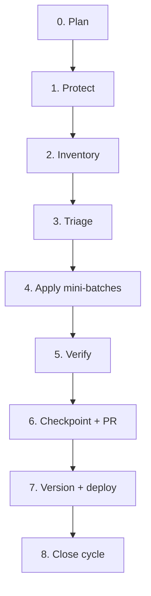

# Manage365 Upstream Sync Process

This document defines how Manage365 reviews [KelvinTegelaar/CIPP](https://github.com/KelvinTegelaar/CIPP) and [KelvinTegelaar/CIPP-API](https://github.com/KelvinTegelaar/CIPP-API) on a regular cadence and ports advantageous changes **without** overwriting fork-specific features.

**Related artifacts**

| Document | Purpose |
|----------|---------|
| [CUSTOM_FEATURE_MAP_*.md](./CUSTOM_FEATURE_MAP_20260617.md) | Protected fork areas — refresh each cycle |
| [FIRST_PASS_REPORT_*.md](./FIRST_PASS_REPORT_20260617.md) | Example first-pass inspection output |
| [UPSTREAM_DELTA_*.md](./UPSTREAM_DELTA_CIPP_20260617.md) | Example delta since last sync base |
| [CIPP_SYNC_CHECKPOINT_*.md](./CIPP_SYNC_CHECKPOINT_20260617.md) | Example cycle checkpoint |
| [README.md](./README.md) | Index of cycle-specific tracking docs |

---

## Principles

1. **Selective intake, not wholesale merge** — cherry-pick or surgical port; never blind `Sync fork → Discard commits`.
2. **Fork features are protected by default** — see `CUSTOM_FEATURE_MAP`. When in doubt, adapt upstream logic into fork files instead of replacing them.
3. **Frontend + API move together** — if a feature needs both repos, plan and ship as a pair (or defer both).
4. **Explicit approval gates** — no production merge without review checklist and version bump.
5. **GitHub “Sync fork” badge is cosmetic** — a large behind-count is expected with selective intake.

---

## Cadence

| Cycle type | When | Duration | Goal |
|------------|------|----------|------|
| **Light delta** | Monthly (or when upstream patch releases) | 2–4 hours | Low-risk bugfixes, data JSON, tests, isolated endpoints |
| **Major cycle** | Quarterly (or after upstream minor e.g. v10.5 → v10.6) | 1–3 days | Full delta inventory, feature intake decisions, dependency review |
| **Feature intake** | As needed (backlog) | 1–5 days each | New upstream capabilities (e.g. SSO, MCP) — design first, then port |
| **Hotfix** | Within 48h of critical upstream security fix | Hours | Cherry-pick specific SHA(s), fast deploy |

**Suggested calendar**

- **1st week of month** — light delta review (optional skip if no upstream activity)
- **First month of quarter** — major cycle for both repos
- **Backlog grooming** — add upstream features to intake queue (see [Feature intake backlog](#feature-intake-backlog))

---

## Roles

| Role | Responsibility |
|------|----------------|
| **Sync lead** | Runs cycle, owns checkpoint docs, approves apply/defer |
| **Reviewer** | Second pair of eyes on high-risk or protected-path changes |
| **Deployer** | Version bump, SWA + all Function App slot deploys |

One person can fill all roles on a small team; the checklist still applies.

---

## Cycle workflow (both repos)

Each cycle uses the same phases. Run **CIPP-API first** when changes are backend-heavy; run in parallel only for independent JSON/test commits.



### Phase 0 — Plan

- [ ] Decide cycle type (light / major / feature intake / hotfix)
- [ ] Record last sync base SHAs (from previous checkpoint or tag)
- [ ] For **feature intake**: complete design Q&A before coding (self-hosted SSO, MCP scope, etc.)

### Phase 1 — Protect

```powershell
# From each repo root — or use Tools/Start-UpstreamSyncCycle.ps1 in CIPP
$date = Get-Date -Format 'yyyyMMdd'
git fetch upstream
git tag "backup/pre-upstream-sync-<repo>-$date" main   # or master for API
git checkout -b "manage365/upstream-sync-<repo>-$date"
```

- [ ] Backup tag on production branch tip
- [ ] Sync branch created (never commit directly to `main` / `master` during review)
- [ ] Working tree clean

### Phase 2 — Inventory

```bash
# Commits since last sync base (replace BASE with checkpoint merge-base or tag)
git log --oneline BASE..upstream/main   # CIPP
git log --oneline BASE..upstream/master # CIPP-API

# Divergence counts
git rev-list --left-right --count main...upstream/main
```

Generate (or update agent-assisted):

- `UPSTREAM_DELTA_CIPP_YYYYMMDD.md` — commits since last base
- `UPSTREAM_DELTA_CIPP_API_YYYYMMDD.md`
- Refresh `CUSTOM_FEATURE_MAP_YYYYMMDD.md` if protected areas changed

### Phase 3 — Triage

Classify **every candidate** into one outcome:

| Outcome | Meaning |
|---------|---------|
| **Apply** | Clean cherry-pick or copy; no protected-path conflict |
| **Adapt** | Port logic surgically; do not replace whole fork files |
| **Already implemented** | Fork already has equivalent behavior — document evidence |
| **Defer** | Worth doing later; needs design, API pair, or conflict resolution |
| **Skip** | Wrong for fork (hosted-only, removes customization, low value) |

**Risk tags:** Low | Medium | High  
**Area tags:** Security, Exchange, Intune, Standards, Auth, Nav/UI, Dependencies, Tests, Data/JSON

**Protected-path rule:** If any file in `CUSTOM_FEATURE_MAP` is touched, outcome must be **Adapt** or **Defer** — never blind **Apply**.

**Pairing rule:** Frontend-only or API-only commits are OK alone; cross-cutting features require both sides in the same release or explicit deferral.

### Phase 4 — Apply mini-batches

- Work in batches of **3–5 commits**, low-risk first
- Order: tests → data JSON → isolated bugfixes → shared components → protected areas last
- After each batch: build/test (see Phase 5)
- Record in `APPLIED_COMMITS_*_YYYYMMDD.md`:

  | Upstream SHA | Fork SHA | Outcome | Notes |

- If cherry-pick conflicts: abort, switch to **Adapt** manual port
- **Do not continue** after a batch failure without fixing or deferring

### Phase 5 — Verify

**Frontend (CIPP)**

```bash
npx next build --webpack
```

**Backend (CIPP-API)** — as applicable:

- Pester tests for touched modules
- Local function host smoke test for changed endpoints

**Manual smoke** (adjust per cycle):

- Applied standards / drift
- Quarantine + email troubleshooter (protected)
- Top-nav search + dashboard v2
- Tenant auth methods
- Any feature touched in this cycle

### Phase 6 — Checkpoint + PR

Write `CIPP_SYNC_CHECKPOINT_YYYYMMDD.md` (and API equivalent) with:

- Branch name, base SHA, tip SHA, backup tag
- Mini-batches table (upstream → outcome)
- Applied / adapted / deferred / skipped lists
- Known concerns and follow-ups
- **Recommendation:** ready for PR / needs more work / stop

PR requirements:

- [ ] Summary references checkpoint doc
- [ ] Lists deferred items explicitly
- [ ] No unrelated changes
- [ ] Reviewer sign-off for High-risk or protected-path adapts

### Phase 7 — Version + deploy

After merge to `main` / `master`:

```powershell
# CIPP — set upstream baseline + Manage365 release
./Tools/Update-Version.ps1 -UpstreamVersion 10.5.1 -Manage365Version 5.12.15

# CIPP-API — edit both files to same upstream baseline
# version_latest.txt
# Config/version_latest.txt
```

- [ ] Bump `public/version.json` + `manage365-version.json` (via script)
- [ ] Bump API `version_latest.txt` (both paths)
- [ ] Update README **Upstream Integration** section
- [ ] Deploy Static Web App
- [ ] Deploy **all** Function App slots (main, processor, standards, audit, user tasks)
- [ ] Confirm Application Settings → version page shows green / no false out-of-date toasts

### Phase 8 — Close cycle

- [ ] Tag sync completion: `sync/cipp-YYYYMMDD` / `sync/cipp-api-YYYYMMDD` on merged tip
- [ ] Record new **sync base SHA** in checkpoint (becomes next cycle's `BASE`)
- [ ] Archive deferred items into next cycle's triage queue
- [ ] Update feature intake backlog status

---

## Feature intake backlog

Use this for **new upstream capabilities** (not small delta fixes). Each item gets a short design before implementation.

| Feature | Status | Design | Notes |
|---------|--------|--------|-------|
| Instance SSO (self-hosted, capability-only) | Planned | Pending spec | Super Admin SSO page + backend; no prod migration until chosen |
| MCP (internal team) | Planned | Pending spec | API client toggle + ExecMcp backend |
| Worker health page | Deferred | — | Needs WorkerMetricsBridge |
| CIPP Users / Container super-admin pages | Deferred | — | Fix 404 tabs |

**Intake template** (copy for new rows):

```markdown
## Feature: [name]
- Upstream refs: [commits / files]
- Fork gap: [what we lack]
- Protected conflicts: [from CUSTOM_FEATURE_MAP]
- Scope: [capability vs migrate-now]
- Phases: [backend → frontend → verify]
- Approval: [ ] design [ ] implement [ ] deploy
```

---

## Decision guide: merge vs cherry-pick vs adapt

| Situation | Action |
|-----------|--------|
| Upstream fix in a file we never customized | Cherry-pick **Apply** |
| Upstream changed same file as fork (CippDataTable, applied-standards, quarantine) | **Adapt** surgical diff |
| Upstream new feature, no fork overlap | Port files + wire nav/API |
| Upstream dependency major bump | **Major cycle** only; full build/test |
| GitHub “238 commits behind” | Ignore unless doing intentional merge for git hygiene |
| Full upstream merge | Separate project; conflict marathon; not default |

---

## Agent / Cursor usage

When asking an agent to help with upstream sync:

1. Point it at this file and the latest `CUSTOM_FEATURE_MAP`.
2. Specify cycle type and **do not reduce fork functionality**.
3. Require checkpoint doc updates per mini-batch.
4. Use rule: `.cursor/rules/upstream-sync.mdc`

---

## Quick start (new cycle today)

```powershell
cd /path/to/CIPP
./Tools/Start-UpstreamSyncCycle.ps1 -Repo CIPP

cd /path/to/CIPP-API
./Tools/Start-UpstreamSyncCycle.ps1 -Repo CIPP-API
```

Then run Phase 2 inventory commands and triage into `UPSTREAM_DELTA_*_YYYYMMDD.md`.

---

## Revision history

| Date | Change |
|------|--------|
| 2026-06-09 | Initial formal process (documents practice from June 2026 v10.5 intake + sync branches) |
